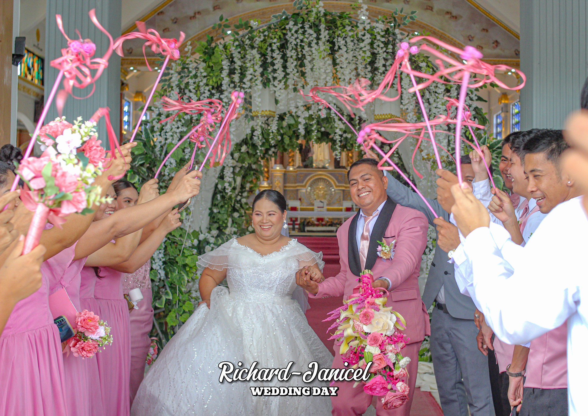
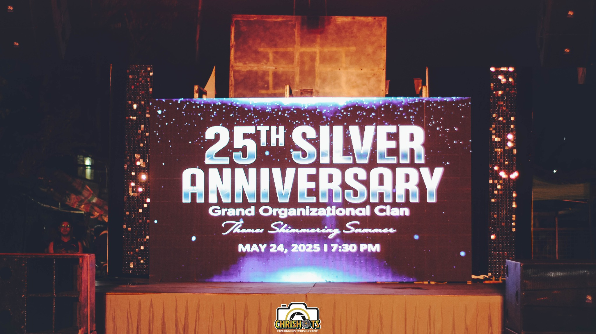

<!DOCTYPE html>
<html lang="en">

<head>
  <meta charset="UTF-8">
  <meta http-equiv="X-UA-Compatible" content="IE=edge">
  <meta name="viewport" content="width=device-width, initial-scale=1.0">

  <!-- 
    - primary meta tags
  -->
  <title>ChriShots</title>
  <meta name="title" content="ChriShots">
  <meta name="description" content="This is a photographer portfolio html template, made by codewithsadee.">

  <!-- 
    - favicon
  -->
  <link rel="shortcut icon" href="./ChriShots.png" type="image/svg+xml">

  <!-- 
    - custom css link
  -->
  <link rel="stylesheet" href="./assets/css/style.css">

  <!-- 
    - custom font link
  -->
  <link rel="stylesheet" href="./assets/font/font.css">

  <!-- 
    - preload images
  -->
  <link rel="preload" as="image" href="./assets/images/loading.png">
  <link rel="preload" as="image" href="./assets/images/loading-circle.svg">

</head>

<body class="active" id="top">

  <!-- 
    -#PRELOADING
  -->

  

    
    
  

  <!-- 
    - #HEADER
  -->

  <header class="header" data-header>
    

      

      <button class="nav-open-btn" aria-label="open menu" data-nav-toggler>
        
      </button>

      <nav class="navbar" data-navbar>

        

          

          <button class="nav-close-btn" aria-label="close menu" data-nav-toggler>
            
            
          </button>
        

        <ul class="navbar-list">

          <li class="navbar-item">
            <a href="#home" class="navbar-link" data-nav-link>Home</a>
          </li>

          <li class="navbar-item">
            <a href="#gallery" class="navbar-link" data-nav-link>Gallery</a>
          </li>

          <li class="navbar-item">
            <a href="#about" class="navbar-link" data-nav-link>About</a>
          </li>

          <li class="navbar-item">
            <a href="#portfolio" class="navbar-link" data-nav-link>Portfolio</a>
          </li>

        </ul>

        
My Address

        <address class="navbar-text">
          623 Coral St. San Agustin, Iriga City, Camarines Sur / 4349 L. Bernardino St. Gen. T. De Leon, Valenzuela City
        </address>

        

          For Inquiry & Booking? Text/Call us at
          <a href="tel:09925996317" class="contact-link">+6399-2599-6317</a>
        

      </nav>

      

    

  </header>

  <main>
    <article>

      <!-- 
        - #HERO
      -->

      <section class="section hero" id="home" aria-label="home">
        

          

          

            <h1 class="h1 hero-title">ChriShots</h1>

            

              <strong class="strong" data-letter-effect>Photographer</strong>
              <strong class="strong" data-letter-effect>Film Maker</strong>
              <strong class="strong" data-letter-effect>Designer</strong>
              <strong class="strong" data-letter-effect>Traveler</strong>
            

            
4 Years Of Experience

          

        

        

      </section>

      <!-- 
        - #GALLERY
      -->

      <section class="section gallery" id="gallery">
        

          <ul class="gallery-list">

            <li class="gallery-item" data-reveal>

              

                <figure class="card-banner img-holder has-before" style="--width: 450; --height: 625;">
                  
                </figure>

                

                  <h3 class="h6">
                    <a href="https://www.facebook.com/photo/?fbid=310437031728285&set=pcb.310440911727897" class="card-title">Teaboom Cafe</a>
                  </h3>

                  Food, Event Photography
                

                

              

              

                <figure class="card-banner img-holder has-before" style="--width: 450; --height: 625;">
                  
                </figure>

                

                  <h3 class="h6">
                    <a href="https://www.facebook.com/ChriShotssss/posts/pfbid0tWeoP3wXMACLZpGNfZFfePD1HgHpGYKcgHCxitjsY9HqN5MJeB9tXJZT51zv7ZCKl" class="card-title">Sunset</a>
                  </h3>

                  Landscape Photography
                

                

              

            </li>

            <li class="gallery-item" data-reveal>

              

                <figure class="card-banner img-holder has-before" style="--width: 450; --height: 625;">
                  
                </figure>

                

                  <h3 class="h6">
                    <a href="https://www.facebook.com/photo?fbid=311541034951218&set=pcb.311541568284498" class="card-title">C-Shake Model</a>
                  </h3>

                  Model, Fashion Photography
                

                

              

              

                <figure class="card-banner img-holder has-before" style="--width: 450; --height: 625;">
                  
                </figure>

                

                  <h3 class="h6">
                    <a href="https://www.facebook.com/ChriShotssss/posts/pfbid02rfWvpFHZ2cpzrgX79NJZZHuiuvtaUy7FduTCwcDyKezGvtvXRsS4f5ngF9tEFvDsl" class="card-title">Couple Photowalk</a>
                  </h3>

                  Photowalk Photography
                

                

              

            </li>

            <li class="gallery-item" data-reveal>

              

                <figure class="card-banner img-holder has-before" style="--width: 450; --height: 625;">
                  
                </figure>

                

                  <h3 class="h6">
                    <a href="https://www.facebook.com/JILNabua/videos/1071186614152849" class="card-title">Jesus Is Lord Church Nabua 16th Anniversary Highlights</a>
                  </h3>

                  Film Maker
                

                

              

              

                <figure class="card-banner img-holder has-before" style="--width: 450; --height: 625;">
                  
                </figure>

                

                  <h3 class="h6">
                    <a href="https://www.facebook.com/media/set/?set=a.194729393299050&type=3" class="card-title">𝙼𝚛. & 𝙼𝚛𝚜 𝙹𝚞𝚍𝚊𝚟𝚊𝚛 Wedding</a>
                  </h3>

                  Wedding Photography
                

                

              

            </li>

            <li class="gallery-item" data-reveal>

              

                <figure class="card-banner img-holder has-before" style="--width: 450; --height: 625;">
                  
                </figure>

                

                  <h3 class="h6">
                    <a href="https://www.facebook.com/media/set/?set=a.384777370960917&type=3" class="card-title">Liberata 28's birthday Photoshoot</a>
                  </h3>

                  Birthday Photography
                

                

              

              

                <figure class="card-banner img-holder has-before" style="--width: 450; --height: 625;">
                  
                </figure>

                

                  <h3 class="h6">
                    <a href="https://www.facebook.com/media/set/?set=a.384902667615054&type=3" class="card-title">Prinson Israel Dedication & 1st Birthday</a>
                  </h3>

                  Christening Photography
                

                

              

            </li>

          </ul>

        

      </section>

      <!-- 
        - #CATEGORY
      -->

      <section class="section category" aria-label="photography category">
        

          <ul class="category-list">

            <li class="category-item" data-reveal>
              <a href="https://www.facebook.com/ChriShotssss/posts/pfbid035zBGitPwQCXr4hWSA79panEmu4rihQN3hBb8GkmyyYuUw1cAkxHbxSyVnbp676sHl" class="category-card">

                <h3 class="h4 card-title">Landscape,</h3>

                <figure class="card-banner img-holder" style="--width: 800; --height: 690;">
                  
                </figure>

              </a>
            </li>

            <li class="category-item" data-reveal>
              <a href="https://www.facebook.com/ChriShotssss/posts/pfbid02CaxgMhHGcJgpttCoTUFp3zVbWnQvi1U44Ld2MbZK4jxf2jw4TvJtdDLshWvYiB7al" class="category-card">

                <h3 class="h4 card-title">Model,</h3>

                <figure class="card-banner img-holder" style="--width: 600; --height: 690;">
                  
                </figure>

              </a>
            </li>

            <li class="category-item" data-reveal>
              <a href="https://www.facebook.com/ChriShotssss/videos/1374678523409247/" class="category-card">

                <h3 class="h4 card-title">Food,</h3>

                <figure class="card-banner img-holder" style="--width: 800; --height: 690;">
                  
                </figure>

              </a>
            </li>

            <li class="category-item" data-reveal>
              <a href="https://www.facebook.com/watch/?v=1071186614152849" class="category-card">

                <h3 class="h4 card-title">Film Maker,</h3>

                <figure class="card-banner img-holder" style="--width: 690; --height: 600;">
                  
                </figure>

              </a>
            </li>

            <li class="category-item" data-reveal>
              <a href="https://www.facebook.com/media/set/?set=a.380641424707845&type=3" class="category-card">

                <h3 class="h4 card-title">Birthday Photoshoot,</h3>

                <figure class="card-banner img-holder" style="--width: 600; --height: 690;">
                  
                </figure>

              </a>
            </li>

            <li class="category-item" data-reveal>
              <a href="https://www.facebook.com/ChriShotssss/posts/pfbid0PTyeEhQ8KTn39PZjH2dpT9mkiqtxgzr6nuy7eQKweaYQwDmwTn7Yd2CPmXBXymp5l" class="category-card">

                <h3 class="h4 card-title">Event Photography,</h3>

                <figure class="card-banner img-holder" style="--width: 690; --height: 600;">
                  
                </figure>

              </a>
            </li>

            <li class="category-item" data-reveal>
              <a href="https://www.facebook.com/ChriShotssss/videos/323614077158964" class="category-card">

                <h3 class="h4 card-title">Wedding Photography,</h3>

                <figure class="card-banner img-holder" style="--width: 800; --height: 690;">
                  
                </figure>

              </a>
            </li>

            <li class="category-item" data-reveal>
              <a href="#" class="category-card">

                <h3 class="h4 card-title">Photowalk,</h3>

                <figure class="card-banner img-holder" style="--width: 800; --height: 690;">
                  
                </figure>

              </a>
            </li>

            <li class="category-item" data-reveal>
              <a href="https://www.facebook.com/ChriShotssss/posts/pfbid0NR3C4qtz8bEHpAbcnDG7WNFyvqhQoajmKwNDHAZBAEwyUw9UmhWz854nXFrey2NQl" class="category-card">

                <h3 class="h4 card-title">Christening Photography.</h3>

                <figure class="card-banner img-holder" style="--width: 600; --height: 690;">
                  
                </figure>

              </a>
            </li>

          </ul>

        

      </section>

      <!-- 
        - #ABOUT
      -->

      <section class="section about" id="about" aria-label="about me">
        

          

            <h2 class="h2 section-title" data-reveal="right">
              Hi. I’m  
              Chris
            </h2>

            

              

                A passionate
                <em class="em">photograher</em>
                who are Owner Of ChriShots and Working in this field for
                <em class="em">last 3 years.</em>
                I’m ready to give you my best.
              

            

          

          <figure class="about-banner" data-reveal="left">

            

              
            

            

          </figure>

          

        

      </section>

      <!-- 
        - #SERVICE
      -->

      <section class="section service" id="service" aria-labelledby="service-lable">

        
My Services

        <ul class="service-list">

          <li data-reveal>
            

              

              

                <h3 class="h3 card-title">Wedding Photography</h3>

                

                  "Capturing Love's Eternal Moments."
                

              

              <a href="https://www.facebook.com/ChriShotssss/posts/pfbid0jkHBrsHjdTnhZQq7Ge1D4b9mUboTAwkxyXgtpVLnhKRt5VEZKY9ispjB5ErrSy7Ml" class="btn-icon" aria-label="See more">
                <svg xmlns="http://www.w3.org/2000/svg" width="43" height="20" viewBox="0 0 43 20" fill="none">
                  <path d="M0 10H41" stroke="white" stroke-width="2" />
                  <path d="M33 1L41.9 10.2727L33 19" stroke="white" stroke-width="2" />
                </svg>
              </a>

            

          </li>

          <li data-reveal>
            

              

              

                <h3 class="h3 card-title">Christening Photography</h3>

                

                  "Sacred moments captured with love."
                

              

              <a href="https://www.facebook.com/ChriShotssss/posts/pfbid0ZhrwvoeYo7eCjvhVFccPT2qbyAwzanWhrKrk7HDxrRyqs1EegsFGhk7CPLh5EoNsl" class="btn-icon" aria-label="See more">
                <svg xmlns="http://www.w3.org/2000/svg" width="43" height="20" viewBox="0 0 43 20" fill="none">
                  <path d="M0 10H41" stroke="white" stroke-width="2" />
                  <path d="M33 1L41.9 10.2727L33 19" stroke="white" stroke-width="2" />
                </svg>
              </a>

            

          </li>

          <li data-reveal>
            

              

              

                <h3 class="h3 card-title">Birthday Photography</h3>

                

                  "Celebrating life's moments, beautifully captured."
                

              

              <a href="https://www.facebook.com/ChriShotssss/posts/pfbid0ezdgE6hUaqkUaKM8EuCbzfWgemZ3YXb3ukdRUKgRrkrGarcxLVbrwoQFYw1oMdePl" class="btn-icon" aria-label="See more">
                <svg xmlns="http://www.w3.org/2000/svg" width="43" height="20" viewBox="0 0 43 20" fill="none">
                  <path d="M0 10H41" stroke="white" stroke-width="2" />
                  <path d="M33 1L41.9 10.2727L33 19" stroke="white" stroke-width="2" />
                </svg>
              </a>

            

          </li>

          <li data-reveal>
            

              

              

                <h3 class="h3 card-title">Event Photography</h3>

                

                  "Capturing moments, framing memories beautifully."
                

              

              <a href="https://www.facebook.com/ChriShotssss/posts/pfbid0873NkZupXASWCL17yA3cgkFDnuXpLwcbvACrLhMYFk8RWvedQyx11euTRTYSHfHgl" class="btn-icon" aria-label="See more">
                <svg xmlns="http://www.w3.org/2000/svg" width="43" height="20" viewBox="0 0 43 20" fill="none">
                  <path d="M0 10H41" stroke="white" stroke-width="2" />
                  <path d="M33 1L41.9 10.2727L33 19" stroke="white" stroke-width="2" />
                </svg>
              </a>

            

          </li>

 <li data-reveal>
            

              

              

                <h3 class="h3 card-title">Film Maker</h3>

                

                  "Cinematic storyteller capturing life's essence."
                

              

              <a href="https://www.facebook.com/ChriShotssss/videos/3328242897467286/" class="btn-icon" aria-label="See more">
                <svg xmlns="http://www.w3.org/2000/svg" width="43" height="20" viewBox="0 0 43 20" fill="none">
                  <path d="M0 10H41" stroke="white" stroke-width="2" />
                  <path d="M33 1L41.9 10.2727L33 19" stroke="white" stroke-width="2" />
                </svg>
              </a>

            

          </li>

        </ul>

      </section>

      <!-- 
        - #PORTFOLIO
      -->

      <section class="section portfolio" id="portfolio" aria-labelledby="portfolio-label">
        

          

            

              <h2 class="h2 section-title" id="portfolio-label" data-reveal>My Recent Work.</h2>

              

                <figure class="card-banner img-holder has-before" style="--width: 850; --height: 700;">
                  
                </figure>

                

                  <h3 class="h4">
                    <a href="https://www.facebook.com/ChriShotssss/videos/1699666340938788" class="card-title">Richard & Janicel Wedding Highlight</a>
                  </h3>

                  
Film

                

                <a href="https://www.facebook.com/ChriShotssss/videos/1699666340938788" class="btn-icon" aria-label="See more">
                  <svg xmlns="http://www.w3.org/2000/svg" width="43" height="20" viewBox="0 0 43 20" fill="none">
                    <path d="M0 10H41" stroke="black" stroke-width="2" />
                    <path d="M33 1L41.9 10.2727L33 19" stroke="black" stroke-width="2" />
                  </svg>
                </a>

              

              

                <figure class="card-banner img-holder has-before" style="--width: 850; --height: 700;">
                  
                </figure>

                

                  <h3 class="h4">
                    <a href="https://www.facebook.com/ChriShotssss/posts/pfbid0iV9MwovUkaX4dGWywq9QiVN73MSGr85qZNZqdrDQf5foGB9h5KmcXpGVRS8cAwZfl" class="card-title">25th Silver Anniversary Grand Organizational Clan</a>
                  </h3>

                  
Event Photography

                

                <a href="https://www.facebook.com/ChriShotssss/posts/pfbid0iV9MwovUkaX4dGWywq9QiVN73MSGr85qZNZqdrDQf5foGB9h5KmcXpGVRS8cAwZfl" class="btn-icon" aria-label="See more">
                  <svg xmlns="http://www.w3.org/2000/svg" width="43" height="20" viewBox="0 0 43 20" fill="none">
                    <path d="M0 10H41" stroke="black" stroke-width="2" />
                    <path d="M33 1L41.9 10.2727L33 19" stroke="black" stroke-width="2" />
                  </svg>
                </a>

              

              

                <figure class="card-banner img-holder has-before" style="--width: 850; --height: 700;">
                  
                </figure>

                

                  <h3 class="h4">
                    <a href="https://www.facebook.com/ChriShotssss/posts/pfbid02KgPdwsg2ugTJkoVLsfbUKDrncf7LRez5AZqCuWwSUv2jyoAkBc4B9QnZEqjgyv54l" class="card-title">Anj Portrait Photoshoot</a>
                  </h3>

                  
Portrait Photography

                

                <a href="https://www.facebook.com/ChriShotssss/posts/pfbid02KgPdwsg2ugTJkoVLsfbUKDrncf7LRez5AZqCuWwSUv2jyoAkBc4B9QnZEqjgyv54l" class="btn-icon" aria-label="See more">
                  <svg xmlns="http://www.w3.org/2000/svg" width="43" height="20" viewBox="0 0 43 20" fill="none">
                    <path d="M0 10H41" stroke="black" stroke-width="2" />
                    <path d="M33 1L41.9 10.2727L33 19" stroke="black" stroke-width="2" />
                  </svg>
                </a>

              

            

            

              

                <figure class="card-banner img-holder has-before" style="--width: 850; --height: 700;">
                  
                </figure>

                

                  <h3 class="h4">
                    <a href="https://www.facebook.com/ChriShotssss/posts/pfbid02TpWJNmkeQp86HjrjizRz8DvXtmzD3s6ctjwJhYzanq8PaRfbJy6q89KgdroxRSicl" class="card-title">Quennie & Mego Wedding</a>
                  </h3>

                  
Film, Wedding Photography

                

                <a href="https://www.facebook.com/ChriShotssss/videos/995437265707081" class="btn-icon" aria-label="See more">
                  <svg xmlns="http://www.w3.org/2000/svg" width="43" height="20" viewBox="0 0 43 20" fill="none">
                    <path d="M0 10H41" stroke="black" stroke-width="2" />
                    <path d="M33 1L41.9 10.2727L33 19" stroke="black" stroke-width="2" />
                  </svg>
                </a>

              

              

                <figure class="card-banner img-holder has-before" style="--width: 850; --height: 700;">
                  
                </figure>

                

                  <h3 class="h4">
                    <a href="https://www.facebook.com/ChriShotssss/posts/pfbid023SnHQUMCWKafXKXU32Ei7cCDYFXCvrkJKQuTS6W9qwvu67Enc54fsLAaD9Taa5m4l" class="card-title">Mr & Ms College Intramurals</a>
                  </h3>

                  
Event Photography

                

                <a href="https://www.facebook.com/ChriShotssss/posts/pfbid023SnHQUMCWKafXKXU32Ei7cCDYFXCvrkJKQuTS6W9qwvu67Enc54fsLAaD9Taa5m4l" class="btn-icon" aria-label="See more">
                  <svg xmlns="http://www.w3.org/2000/svg" width="43" height="20" viewBox="0 0 43 20" fill="none">
                    <path d="M0 10H41" stroke="black" stroke-width="2" />
                    <path d="M33 1L41.9 10.2727L33 19" stroke="black" stroke-width="2" />
                  </svg>
                </a>

              

                            

                <figure class="card-banner img-holder has-before" style="--width: 850; --height: 700;">
                  
                </figure>

                

                  <h3 class="h4">
                    <a href="https://www.facebook.com/ChriShotssss/posts/pfbid0cSoHuejUYPMZ2Fkax46Wr91Y1iroBKzpDrvz5Lk1GtnTYQvhEhjrexGNCS8aUEpcl" class="card-title">San Agustin(Stand Alone)Senior High School 8th Gradution</a>
                  </h3>

                  
Event Photography

                

                <a href="https://www.facebook.com/ChriShotssss/posts/pfbid0cSoHuejUYPMZ2Fkax46Wr91Y1iroBKzpDrvz5Lk1GtnTYQvhEhjrexGNCS8aUEpcl" class="btn-icon" aria-label="See more">
                  <svg xmlns="http://www.w3.org/2000/svg" width="43" height="20" viewBox="0 0 43 20" fill="none">
                    <path d="M0 10H41" stroke="black" stroke-width="2" />
                    <path d="M33 1L41.9 10.2727L33 19" stroke="black" stroke-width="2" />
                  </svg>
                </a>

              

 

                <figure class="card-banner img-holder has-before" style="--width: 850; --height: 700;">
                  
                </figure>

                

                  <h3 class="h4">
                    <a href="https://www.facebook.com/ChriShotssss/posts/pfbid02q2kufpqpVWYpCZEwY7Y5fZCcMp5zgGy2GTfM7QqGhMscgSYuGX9xN1wa7bcf76Pfl" class="card-title">Binibining Sta Crus Sur 2025</a>
                  </h3>

                  
Event Photography

                

                <a href="https://www.facebook.com/ChriShotssss/posts/pfbid02q2kufpqpVWYpCZEwY7Y5fZCcMp5zgGy2GTfM7QqGhMscgSYuGX9xN1wa7bcf76Pfl" class="btn-icon" aria-label="See more">
                  <svg xmlns="http://www.w3.org/2000/svg" width="43" height="20" viewBox="0 0 43 20" fill="none">
                    <path d="M0 10H41" stroke="black" stroke-width="2" />
                    <path d="M33 1L41.9 10.2727L33 19" stroke="black" stroke-width="2" />
                  </svg>
                </a>

              

            

          

          

        

      </section>

    </article>
  </main>

  <!-- 
    - #FOOTER
  -->

  <footer class="footer">

    

      

        
Contact Us

        <h2 class="h2 section-title" data-reveal>
          For inquiry, Booking? Send Message.
        </h2>

        

        

        

        

        

        

      

    

    

      

        

        <ul class="social-list">

          <li>
            <a href="https://www.facebook.com/ChriShotssss" class="social-link">FB</a>
          </li>

          <li>
            <a href="https://www.instagram.com/chrishotss/" class="social-link">IG</a>
          </li>

        </ul>

        
Capturing Life's Timeless Moments

      

    

    

      
    

  </footer>

  <!-- 
    - #BACK TO TOP
  -->

  <a href="#top" class="back-top-btn" aria-label="back to top" data-back-top-btn>0%</a>

  <!-- 
    - #CUSTOM CURSOR
  -->

  

  <!-- 
    - custom js link
  -->
  

</body>

</html>
